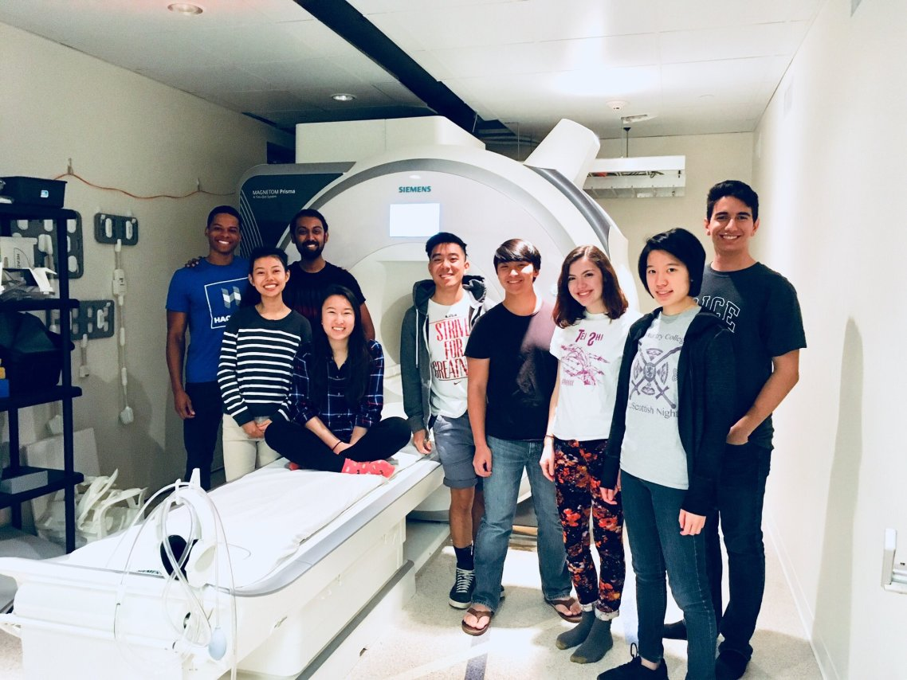

## teaching
***
Teaching is one of my greatest joys...

### currently

#### NB314QC: Math Tools for Neuroscience
Along with my classmate and friend, [Alex Chen](https://twitter.com/alexbchen), I designed a new January-term course for the Harvard Program in Neuroscience. We condensed the fundamentals of linear algebra, dynamical systems theory, and probability theory (as applied to neuroscience) all into a one-month crash course!

All course materials (including the syllabus, lecture notes, and problem sets) are publically availible on [our course's Canvas site](https://canvas.harvard.edu/courses/71556).

### previously
At Rice, I was a teaching assistant for:

* **NEUR/PSYC 362:** Cognitive Neuroscience _(Spring ’16, ’17, ’18)_
* **NEUR/CAAM 416:** Neural Computation _(Spring ’18)_ 
  * I contributed [a lecture](./bci_lecture.pdf) on Bayesian Causal Inference in perception.
* **NEUR/BIOC 385:** Fundamentals of Neuroscience _(Fall ’16, ’17)_
* **STAT 310:** Probability and Statistics _(Fall ‘16)_
* **PSYC 203:** Intro to Cognitive Psychology _(Fall ’15)_

Before I left the Yau Lab, I gave a little tutorial on [model building and fitting](./lai_modeling.pdf).

I was also a mentor at [BrainSTEM](https://brainstem.club/), an after-school neuroscience program at [KIPP Sunnyside High School](http://kipphouston.org/sunnyside). The program serves to promote interest in STEM and neuroscience to underrepresented minorities.

#### COLL 158: How Music Plays The Brain

By far, my favorite teaching endeavor has been bringing [COLL 158: How Music Plays the Brain](https://courses.rice.edu/admweb/!SWKSCAT.cat?p_action=CATALIST&p_acyr_code=2019&p_crse_numb=158&p_subj=COLL) to life! I designed and taught 3 semesters of this seminar course on the intersection of music and neuroscience. _COLL 158 won the 2017 Rice University [Student-Taught Course Teaching award](https://cte.rice.edu/stc#award)!_

All course materials (including the syllabus and lecture slides) from the last rendition of the course (Spring 2018) are publically availible on [the course's Canvas site](https://canvas.rice.edu/courses/10423/).

_**COLL 158 visits Baylor College of Medicine's [Core for Advanced Magnetic Resonance Imaging](https://www.bcm.edu/research/centers/advanced-mr-imaging) (CAMRI)**_

> _“Students will leave this course having developed a greater appreciation for the power of music through dialogues between an age-old art and a budding field of science.”_
&nbsp;&nbsp;&nbsp;&nbsp;&nbsp;&nbsp;&nbsp;&nbsp;&nbsp;&nbsp;&nbsp;&nbsp;&nbsp;&nbsp;&nbsp;&nbsp;&nbsp;&nbsp;&nbsp;&nbsp;&nbsp;&nbsp;&nbsp;&nbsp;&nbsp;&nbsp;&nbsp;&nbsp;&nbsp;&nbsp;&nbsp;&nbsp;&nbsp;&nbsp;&nbsp;&nbsp;&nbsp;&nbsp;&nbsp;&nbsp;&nbsp;&nbsp;&nbsp;&nbsp;&nbsp;&nbsp;&nbsp;&nbsp;&nbsp;&nbsp;&nbsp;&nbsp;&nbsp;&nbsp;&nbsp;&nbsp;&nbsp;&nbsp;&nbsp;&nbsp;&nbsp;&nbsp;&nbsp;&nbsp;&nbsp;&nbsp;&nbsp;&nbsp;&nbsp;&nbsp;&nbsp;&nbsp;&nbsp;&nbsp;&nbsp;&nbsp;&nbsp; - lofty goals from the course syllabus

So, did I fulfill my promises? :p

#### Course Evaluations
* [what they thought of the course](./coll158_evals.pdf) 
* [what they thought of me](./coll158_teaching.pdf)

***
[back](./)
