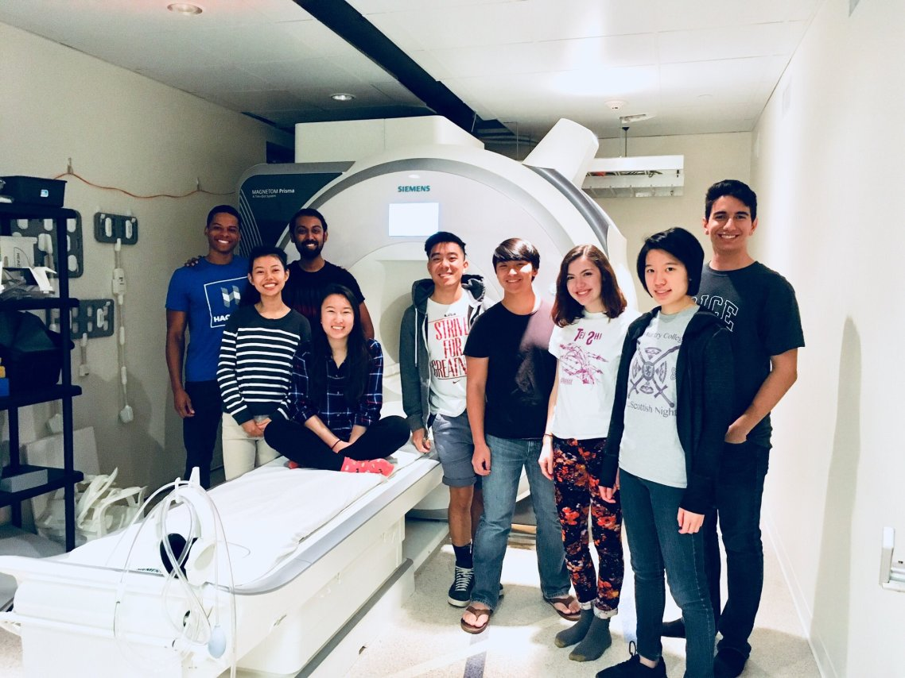

## teaching
***
> "Docendo discimus...By teaching, we learn."  - Seneca

Teaching is one of my greatest joys :-)

### currently

In Spring '21, I TF-ed a new [GenEd](https://gened.fas.harvard.edu/){:target="_blank"} course: [Artificial and Natural Intelligence](https://gened.fas.harvard.edu/classes/artificial-and-natural-intelligence){:target="_blank"}, and also gave a [guest lecture on machine consciousness](https://www.youtube.com/watch?v=kle1uBIW8dM&ab_channel=LucyLai){:target="_blank"}.
#### Course Evaluations
* [Spring 2021](./files/gened1125_evals.pdf){:target="_blank"}

I am yearly mentor for [HPREP](https://hprep.wordpress.com/){:target="_blank"}, a ten-week science enrichment and mentorship program for underserved and underrepresented high school students in the Boston area.

#### NB314QC / NB212: Math Tools for Neuroscience
[Alex Chen](https://twitter.com/alexbchen){:target="_blank"} and I designed and taught a new January-term course for the Harvard Program in Neuroscience. We condensed the fundamentals of linear algebra, dynamical systems theory, and probability theory (as applied to neuroscience) into a one-month crash course.

All course materials (including the syllabus, lecture notes, and problem sets) are publicly available on [our course Canvas site](https://canvas.harvard.edu/courses/71556){:target="_blank"}.

_Update (Sept 2020):_ Math Tools has been converted into a full-semester course and was added as a foundational requirement for the PiN [Certificate in Computational Neuroscience](https://www.hms.harvard.edu/dms/neuroscience/curriculum/certificate.html){:target="_blank"}. Much thanks to [Ella Batty](https://ebatty.github.io/){:target="_blank"} for helping push this effort :-) A complete syllabus, YouTube video lectures, and Google Colab notebook assignments are freely available [here](https://github.com/ebatty/MathToolsforNeuroscience){:target="_blank"}. Much of this course was modeled after the amazing [Neuromatch Academy online computational neuroscience course](https://www.neuromatchacademy.org/syllabus){:target="_blank"}.

#### Course Evaluations
* [J-Term 2020](./files/nb314qc_evals.pdf){:target="_blank"}
* [Fall 2020](./files/nb212_evals.pdf){:target="_blank"}

### previously
At Rice, I was a teaching assistant for:

* Cognitive Neuroscience _(Spring ’16, ’17, ’18)_
* Neural Computation _(Spring ’18)_
* Fundamentals of Neuroscience _(Fall ’16, ’17)_
* Probability and Statistics _(Fall ‘16)_
* Intro to Cognitive Psychology _(Fall ’15)_

I was also a mentor at [BrainSTEM](https://tmcbrainstem.org/){:target="_blank"}, an after-school neuroscience program at [KIPP Sunnyside High School](http://kipphouston.org/sunnyside){:target="_blank"}. The program serves to promote interest in STEM and neuroscience in underserved areas of Houston.

#### COLL 158: How Music Plays The Brain

By far, my favorite teaching endeavor has been bringing [COLL 158: How Music Plays the Brain](https://courses.rice.edu/admweb/!SWKSCAT.cat?p_action=CATALIST&p_acyr_code=2019&p_crse_numb=158&p_subj=COLL){:target="_blank"} to life! I designed and taught 3 semesters of this seminar course on the intersection of music and neuroscience. _COLL 158 won the 2017 Rice University [Student-Taught Course Teaching award](https://cte.rice.edu/stc#award){:target="_blank"}!_

All course materials (including the syllabus and lecture slides) from the last rendition of the course (Spring 2018) are publicly available on [the course Canvas site](https://canvas.rice.edu/courses/10423/){:target="_blank"}.

_**COLL 158 visits Baylor College of Medicine's [Core for Advanced Magnetic Resonance Imaging](https://www.bcm.edu/research/centers/advanced-mr-imaging){:target="_blank"} (CAMRI)**_

> “Students will leave this course having developed a greater appreciation for the power of music through dialogues between an age-old art and a budding field of science.”  - from the syllabus

Did I fulfill my promises? :-)

#### Course Evaluations
* [what they thought of the course](./files/coll158_evals.pdf){:target="_blank"}
* [what they thought of me](./files/coll158_teaching.pdf){:target="_blank"}

***
[back](./)
